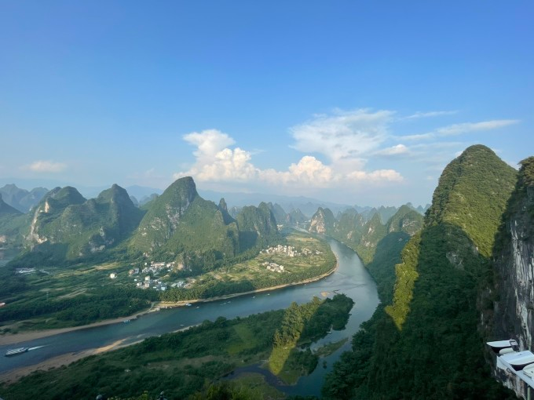
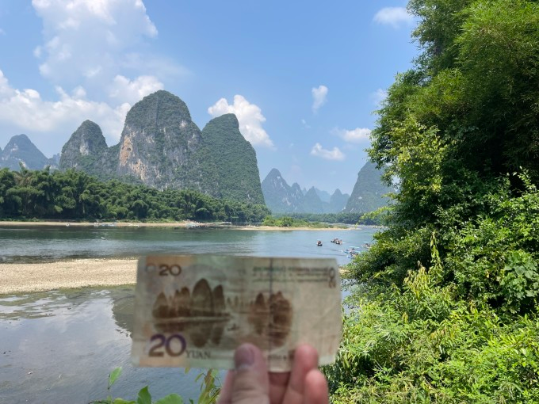
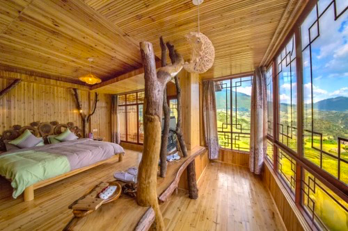

# 深圳 - 云南

## 行程安排
* 深圳-阳朔
* 阳朔-龙脊梯田

### 深圳-阳朔兴坪
* 行：525km,车程6小时
* 吃：桂林米粉
* 住：贵的房间风景好可看双峰，或者房间普通公共区域风景好
* 玩：逛古镇，相公山（套票180，包船车门票）

***

### 阳朔兴坪-龙脊梯田
* 行：200km,车程3小时
* 吃：
* 住：龙胜龙脊壹号观光酒店，豪华大床（632）双床（598）
* 玩：逛梯田，日出日落

